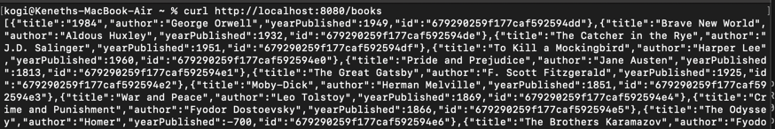
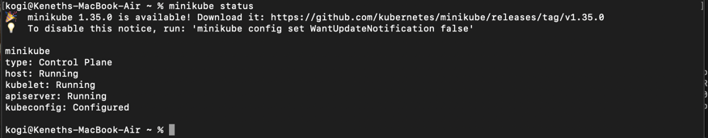
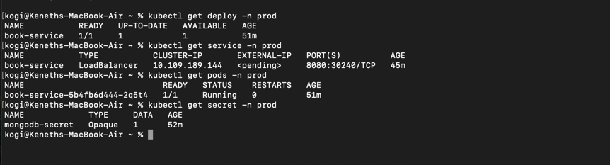
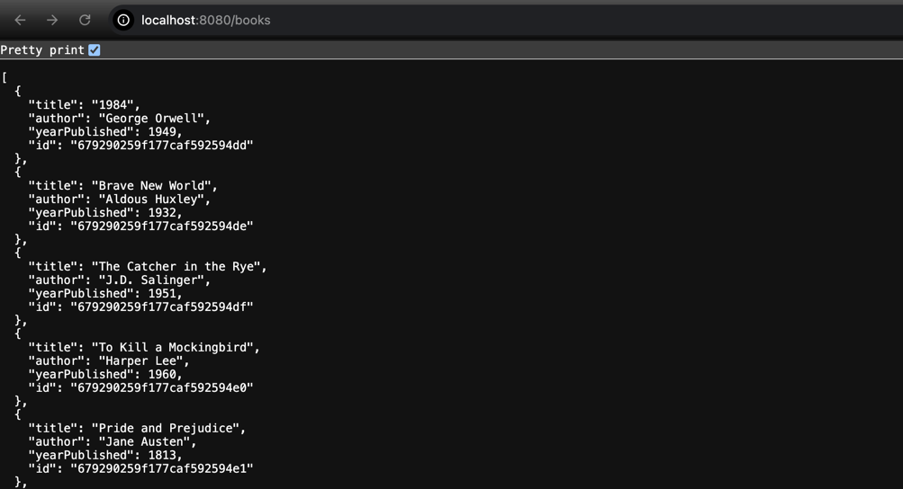
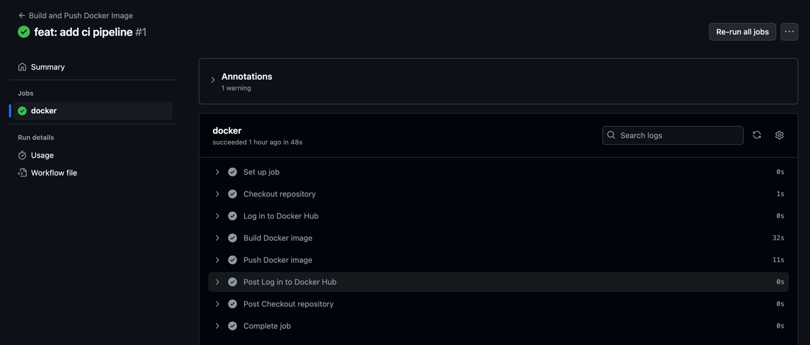

# Application Deployment Documentation

**Overview**

This repository contains a simple application designed to demonstrate containerization, CI/CD automation, and Kubernetes deployment. The application includes:
1. A Spring Boot REST API with a single endpoint (e.g., GET /books).
2. Dockerized application setup.
3. CI/CD pipeline for building and pushing the Docker image to a docker hub container registry.
4. Kubernetes manifests for deploying the application on Minikube.

**Steps to Build and Run the Application Locally Using Docker**

1. Clone the Repository

`git clone <repository-url>
cd <repository-name>`

2. Build the Docker Image

`docker build -t springboot-app .`

3. Run the Docker Container

`docker run -d -p 8080:8080 springboot-app
`
4. Access the Application

The service will be accessible at: localhost:8080/books

**Steps to Deploy the Application on Minikube**

1. Start Minikube

Start Minikube with sufficient resources:

`minikube start --cpus=2 --memory=2048
`
2. Enable Docker in Minikube

Use Minikube’s Docker environment to build images directly:

`eval $(minikube docker-env)
`
3. Check minikube status 

3. Create a namespace to deploy the service

`kubectl create ns prod`

3. Apply Kubernetes Manifests 

secret.yaml (To store the mongodb uri connection )

`kubectl apply -f kubernetes/secret.yaml -n prod
`

deployment.yaml (for deploying the application)

`kubectl apply -f kubernetes/deployment.yaml -n prod
`

service.yaml (for exposing the application)

`kubectl apply -f kubernetes/service.yaml -n prod
`

5. Verify the Deployments

`kubectl get pods -n prod,
kubectl get services -n prod, kubectl get secret -n prod, kubectl get deploy -n prod`

6. Access the Application

port forward the service

`kubectl port-forward service/book-service 30007:8080 -n prod
`
http://localhost/books

**CI/CD Pipeline Explanation**

The CI/CD pipeline is defined in .github/workflows/docker-build-push.yml. It automates the following steps:

* Build the Docker Image:
The workflow uses the docker build command to create an image.

* Push the Image to a Registry:
The workflow pushes the image to Docker Hub.
Authentication credentials are securely stored as GitHub Secrets (DOCKER_USERNAME and DOCKER_PASSWORD).

* Triggers:
The pipeline runs on every push or pull_request to the main branch.

Assumptions and Decisions

A simple REST API (GET /health) was implemented using Spring Boot for ease of demonstration.

**Challenges Faced**

Docker Build Caching: Optimizing the Dockerfile to cache dependencies for faster rebuilds.

Ensured correct configuration for NodePort services to expose the application locally.

CI/CD Secrets Management: Safeguarding registry credentials using GitHub Secrets.

